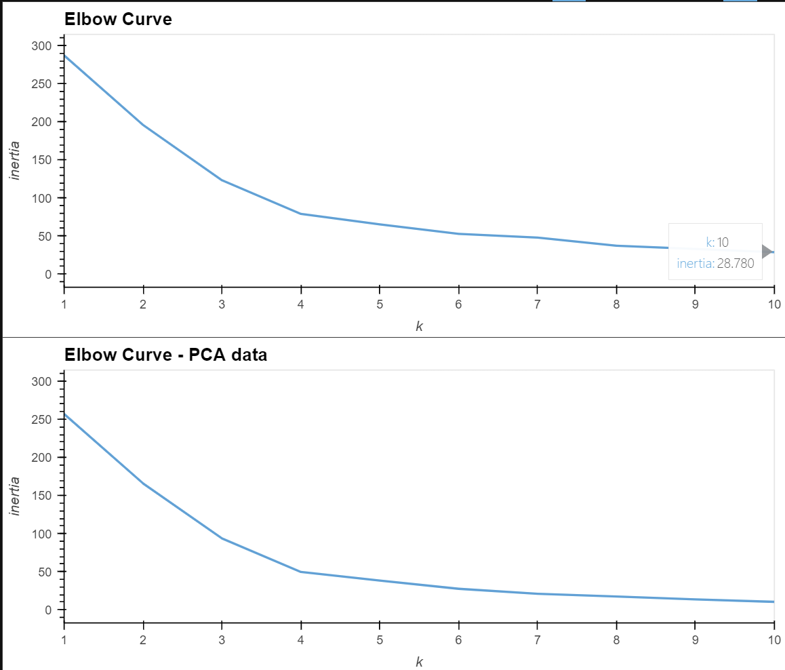
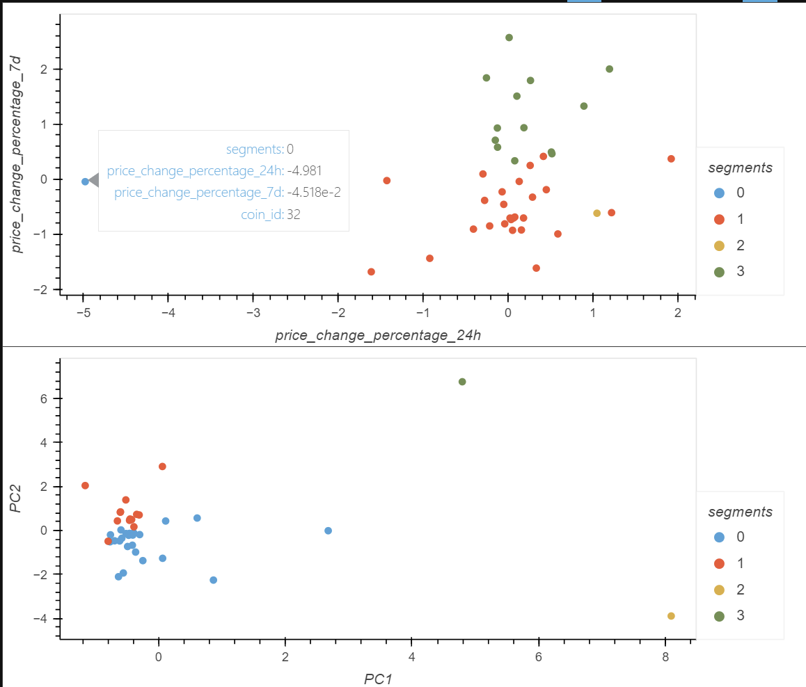

# CryptoClustering

## Overview

The purpose is to undertaken unsupervised learning (K-means and Principal Component Analysis) to predict if cryptocurrencies are affected by 24-hour or 7-day price changes.

Data from a csv is read into a DataFrame, normalised using StandardScaler which is used to fit the K-Means model. This is then optimised by undertaking a PCA to reduce the dimensions and performing K-Means again where comparison plots are output.

## Results

For this dataset, it seems the optimal k-value using the original data and PCA data are both the same value, 4. This suggests that the segmentation of crypto coins may yield similar results between the dataset with all features compared to the PCA analysis.

<br><br>

After reducing the number of dimensions using PCA, approximately 89.5% of the total variance is explained by the 3 PCA variables.

Analysis of both datasets using K-means and plotting as a scatter plot shows that there are 2 clear coin clusters with 2 other segments that may be outliers or forced to be an additional segment due to the number of clusters chosen for the analysis.

After visually analysing the cluster analysis results, it can be seen that by condensing the number of features or components, the segmentation is a lot tighter/less scattered; the segments are less overlapping compared to undertaking K-means with more features.

Using the full features dataset, segments 1 & 3 should be focussed on, while with the PCA dataset, segments 0 & 1 should be focussed on for further targetting or analysis.

<br><br>

## Environment

python3.7

Modules required:

```python
import pandas as pd
import hvplot.pandas
from sklearn.cluster import KMeans
from sklearn.decomposition import PCA
from sklearn.preprocessing import StandardScaler
```

## References

Data for this dataset was generated by edX Boot Camps LLC, and is intended for educational purposes only.
